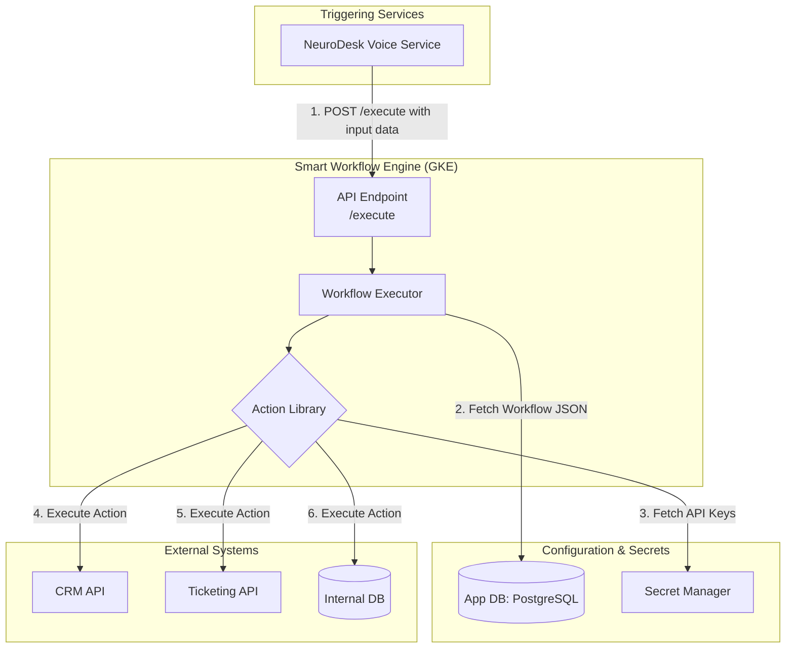

# Technical Design Document: Smart Workflow Engine

**Version:** 1.0
**Author:** Gemini Code Assist
**Status:** Draft
**Related Epics:** "Smart Workflow Engine", "Intelligent Escalation"

---

## 1. Introduction

### 1.1. Purpose

The Smart Workflow Engine is the core backend microservice that executes automated business logic based on predefined, user-configured workflows. It acts as the central orchestrator, taking structured input from services like the `NeuroDesk Voice Service` and performing a series of actions, such as integrating with third-party tools, making decisions based on conditional logic, or escalating tasks to human agents.

### 1.2. Scope

**In Scope:**

- Executing workflows defined in a JSON-based schema.
- A REST API to trigger workflow executions.
- A library of "actions" that can be performed (e.g., `send-email`, `create-crm-contact`, `create-ticket`).
- Conditional logic (if/then/else) based on input data (e.g., `confidence_score > 0.95`).
- Securely calling external APIs (e.g., CRMs, Ticketing Systems) using credentials from a secret manager.
- Logging the full execution path and outcome of each workflow run for auditing.

**Out of Scope:**

- The UI for building workflows (this is handled by the `frontend` service, which generates the JSON definition).
- The initial parsing and intent recognition of voice requests (handled by upstream AI services).
- Storing and managing the workflow JSON definitions themselves (this is handled by the `backend-api` and stored in the main application DB).

---

## 2. High-Level Design

The service will be a containerized Node.js application deployed on GKE. It is designed to be stateless, receiving a workflow definition and input data for each execution request.

### 2.1. Architecture Diagram



### 2.2. Data Flow

1.  **Trigger:** An upstream service (e.g., `NeuroDesk Voice Service`) makes a POST request to `/execute` with a `workflowId` and a payload of input data (e.g., `{ "transcription": "...", "intent": "...", "confidence": 0.88 }`).
2.  **Workflow Fetch:** The engine retrieves the corresponding workflow's JSON definition from the main application database using the `workflowId`.
3.  **Execution:** The `Workflow Executor` parses the JSON and begins executing the steps sequentially.
4.  **Conditional Logic:** If a step is a conditional block, the engine evaluates the condition against the input data. It then follows the appropriate branch (`if` or `else`).
5.  **Action Execution:** When an "action" step is encountered, the engine calls the relevant function from its `Action Library`.
6.  **External Interaction:** The action function retrieves necessary API keys from Google Secret Manager and makes the call to the external system (e.g., create a contact in Salesforce).
7.  **Logging & Completion:** The engine logs the result of each step. The execution completes when the end of the workflow path is reached.

---

## 3. Low-Level Design

### 3.1. Technology Stack

- **Language:** Node.js (TypeScript)
- **Framework:** Express.js or Fastify
- **Key Libraries:**
  - `axios`: For making external HTTP API calls.
  - `google-cloud/secret-manager`: To access secrets.
  - `pg`: To connect to the PostgreSQL database.

### 3.2. Workflow JSON Schema

The workflow will be represented as a JSON object with a list of steps.

```json
{
  "id": "wf_123",
  "name": "New Customer Voice Inquiry",
  "steps": [
    {
      "id": "step_1",
      "type": "condition",
      "condition": "input.confidence > 0.95",
      "if": "step_2",
      "else": "step_3"
    },
    {
      "id": "step_2",
      "type": "action",
      "action": "create-crm-contact",
      "params": {
        "name": "input.entities.name",
        "phone": "input.customer.phone"
      },
      "next_step": "step_4"
    },
    {
      "id": "step_3",
      "type": "action",
      "action": "create-ticket",
      "params": {
        "context": "input"
      },
      "next_step": null
    },
    {
      "id": "step_4",
      "type": "action",
      "action": "send-sms",
      "params": {
        "to": "input.customer.phone",
        "message": "Thanks! We've created a profile for you."
      },
      "next_step": null
    }
  ]
}
```

### 3.3. API Endpoints

`POST /execute`

- **Description:** Triggers a workflow execution.
- **Request Body:**
  ```json
  {
    "workflowId": "wf_123",
    "input": {
      "transcription": "Hi, this is John Doe...",
      "confidence": 0.88,
      "intent": "new_inquiry",
      "entities": { "name": "John Doe" },
      "customer": { "phone": "+15551234567" }
    }
  }
  ```
- **Security:** Internal endpoint, secured via service-to-service authentication (e.g., JWT or mTLS).

### 3.4. Action Library

The `Action Library` will be a directory of modules, where each module corresponds to an action type. This makes the engine extensible.

- `actions/create-ticket.js`
- `actions/send-email.js`
- `actions/update-crm.js`

Each action will have a standard interface: `async function execute(params, secrets)`.

---

## 4. Monitoring & Auditing

- **Logging:** Structured logs will be written for every step of every execution, including the `workflowId`, `executionId`, `stepId`, `status` (success/failure), and outcome. This is critical for debugging user-created workflows.
- **Metrics:** Prometheus metrics will track `workflow_executions_total`, `workflow_execution_duration_seconds`, and `action_executions_total{action="create-ticket"}`.
- **Alerting:** Alerts will be configured for a high rate of failed workflow executions or failures in specific critical actions.
